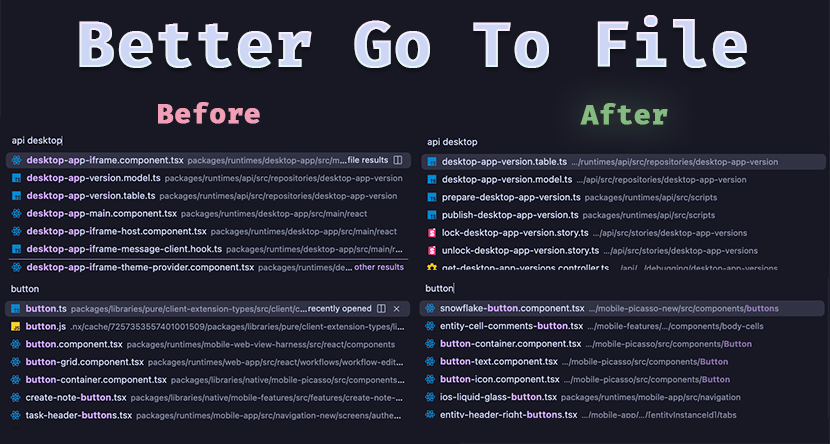

# Better Go To File



## What is Better Go To File?

Better Go To File is a smarter `Go to File` picker for VS Code style editors. It keeps the speed of `Cmd/Ctrl+P`, but ranks results with more of the context you already use when navigating a real codebase.

## The Problem

Once a repo gets large, the default picker starts to fail in predictable ways:

- **Duplicate filenames** like `index.ts`, `routes.ts`, and `button.tsx` crowd the top of the results.
- **Monorepo path noise** makes it hard to tell which package a file actually belongs to.
- **Weak context** means the picker ignores what you opened recently, what file you are in, and what package you are working on.
- **Short queries** are treated as if they were precise, even when they clearly are not.

## What Better Go To File Does Differently

- **Ranks by intent, not just text.** It combines lexical matching with frecency, editor context, and Git signals.
- **Learns your workflow.** Recently and frequently opened files rise naturally, especially for broad or empty queries.
- **Understands monorepos.** Package roots matter, and result rows keep the package name visible when paths are truncated.
- **Uses Git intelligently.** Current worktree activity and contributor overlap help ambiguous results surface the files you are actually likely to want.
- **Stays skimmable.** The picker is optimized for fast scanning instead of dumping long noisy paths into every result row.

<p align="center">
  <a href="https://marketplace.visualstudio.com/items?itemName=Braden.better-go-to-file">
    
  </a>
  <a href="https://marketplace.visualstudio.com/items?itemName=Braden.better-go-to-file">
    
  </a>
  <a href="https://open-vsx.org/extension/Braden/better-go-to-file">
    
  </a>
  <a href="https://open-vsx.org/extension/Braden/better-go-to-file">
    
  </a>
</p>

<p align="center">
  <a href="https://github.com/Braden1996/BetterGoToFile/actions/workflows/checks.yml">
    
  </a>
  <a href="https://github.com/Braden1996/BetterGoToFile/releases/latest">
    
  </a>
  <a href="https://github.com/Braden1996/BetterGoToFile/releases/latest">
    
  </a>
</p>

## Install

- **VS Code**: install from the [Visual Studio Marketplace](https://marketplace.visualstudio.com/items?itemName=Braden.better-go-to-file).
- **Open VSX editors**: install from [Open VSX](https://open-vsx.org/extension/Braden/better-go-to-file).
- **Manual install**: download the latest [VSIX from GitHub Releases](https://github.com/Braden1996/BetterGoToFile/releases/latest).
- **Cursor note**: if extension search lags Open VSX, use `Extensions: Install from VSIX...`.

## Keyboard Shortcut

Replace the default `Cmd+P` picker with Better Go To File:

```json
[
  {
    "key": "cmd+p",
    "command": "-workbench.action.quickOpen"
  },
  {
    "key": "cmd+p",
    "command": "betterGoToFile.open",
    "when": "!inQuickOpen"
  }
]
```

<details>
<summary>Prefer a separate shortcut instead?</summary>

```json
[
  {
    "key": "cmd+u",
    "command": "betterGoToFile.open",
    "when": "!inQuickOpen"
  }
]
```

</details>

## How It Works

Every search goes through a few layers:

1. **Candidate indexing** across the workspace, with package-root awareness
2. **Lexical filtering** so every query token still has to match
3. **Context reranking** from frecency, active file/package proximity, open tabs, and tracked state
4. **Git priors** from contributor history and live worktree activity when the query is ambiguous

For the full scoring model, diagrams, and debugging CLI commands, see [docs/scoring.md](docs/scoring.md).

<details>
<summary>Signals used by the scorer</summary>

- **Frecency** from recent and repeated file opens
- **Editor context** from the active file, same package, open tabs, and nearby directories
- **Git state** from tracked, ignored, and untracked status
- **Contributor overlap** from historical Git areas and file lineage
- **Session overlay** from the files you are changing right now

</details>

## Debugging and Development

- **Inspect scores locally** with `bun run score -- --help`
- **See ranked results** with `bun run score:search -- --repo /path/to/repo --debug button`
- **Explain one file** with `bun run score:explain -- --repo /path/to/repo button path/to/file.tsx`
- **Run the full validation pass** with `bun run check`

Runtime code lives in `src/`. Tests live in `test/`.
