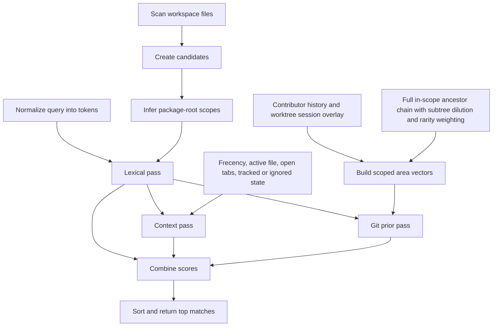
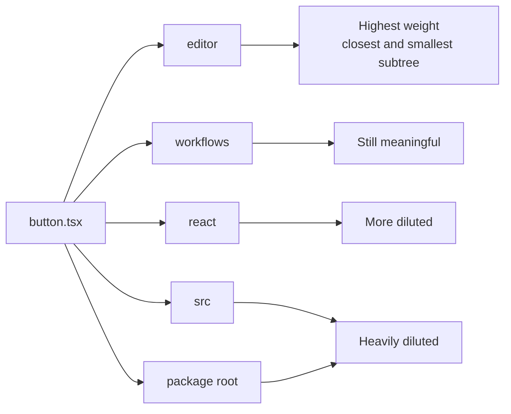

# Better Go To File

VSCode is great, but the Go to File (`⌘ + P`) menu's naive fuzzy search starts to become a friction point inside large monorepos (too many generic named files etc).

Better Go To File aims to reconstruct this Go to File menu but employs a more powerful scoring algorithm behind the scenes; one that considers [frecency](https://en.wikipedia.org/wiki/Frecency), Git author relationships to infer team-mates and their touched files, and a few other heuristics.

As a bonus, when display search items, it truncates paths from the left but excludes the package name.

## Keyboard Shortcuts

Open `Preferences: Open Keyboard Shortcuts (JSON)` and add the bindings you want to `keybindings.json`.

Replace the default `Cmd+P` picker with Better Go To File:

```json
[
  {
    "key": "cmd+p",
    "command": "-workbench.action.quickOpen"
  },
  {
    "key": "cmd+p",
    "command": "betterGoToFile.open",
    "when": "!inQuickOpen"
  }
]
```

Add another shortcut such as `Cmd+U` without changing `Cmd+P`:

```json
[
  {
    "key": "cmd+u",
    "command": "betterGoToFile.open",
    "when": "!inQuickOpen"
  }
]
```

If your `keybindings.json` already has entries, paste just the objects into the existing array.

## Search Algorithm

### Overview

1. Build a candidate list from workspace files.
2. Infer package roots from directories that contain `package.json` or `project.json`.
3. Normalize the query to lowercase tokens split on whitespace.
4. Run a lexical pass. Every token must match each candidate somewhere, or the candidate is dropped.
5. For empty input, rank on frecency alone. For non-empty input, add context scores from frecency, active file/package proximity, open tabs, and Git tracked state.
6. Add Git priors from contributor history and current worktree activity, using scope-bounded ancestor propagation that is diluted by subtree size and contributor frequency.
7. Sort by total score, then lexical score, then path/name tiebreakers.



## Candidate Index

- Scan workspace folders using `betterGoToFile.workspaceIndex.fileGlob`. The default is `**/*`.
- Respect `betterGoToFile.workspaceIndex.maxFileCount` when it is set above `0`.
- Exclude configured directory names such as `.git`, `node_modules`, `dist`, `out`, `.next`, `.nx`, `.turbo`, and `coverage`.
- Prefer a Git-backed file listing when the workspace folder is inside a repository. Filesystem scans skip symbolic links, and Git-backed scans exclude tracked symbolic-link entries.
- Store each candidate as:
  - `basename`
  - `relativePath`
  - `directory`
  - `packageRoot`
  - lowercase search fields for basename and full path
- Resolve `packageRoot` as the nearest ancestor directory containing `package.json` or `project.json`.

This means a file like `packages/runtimes/mobile-app/src/button.tsx` carries both its full path and the nearest package root `packages/runtimes/mobile-app`. That package root also acts as the Git area boundary: area propagation stays inside the package and never keeps walking up toward repo-wide ancestors.

## Query Processing

- Trim the query.
- Lowercase it.
- Split on whitespace into tokens.
- Use AND semantics: every token must match the candidate somewhere.
- If the query is empty, skip the lexical pass and rank on frecency only.
- For queries shorter than 3 non-space characters, taper non-frecency reranking signals in linearly until they reach full strength.

## Lexical Scoring

For each token, the scorer stops at the first matching category in this order:

| Order | Match type                              | Notes                                                               |
| ----- | --------------------------------------- | ------------------------------------------------------------------- |
| 1     | Basename exact                          | `button.tsx` matches `button.tsx`                                   |
| 2     | Full path exact                         | `src/button.tsx` matches the whole relative path                    |
| 3     | Full path prefix                        | Only used when the token contains a path separator                  |
| 4     | Basename prefix                         | `button` matches `button-grid.component.tsx`                        |
| 5     | Basename boundary                       | Match starts at a boundary such as `-`, `_`, `.`, `/`, or camelCase |
| 6     | Basename substring                      | Lower-value basename containment                                    |
| 7     | Package exact/prefix/boundary/substring | Uses the basename of the nearest package root                       |
| 8     | Full path boundary                      | Boundary match anywhere in the path                                 |
| 9     | Full path substring                     | Lower-value path containment                                        |
| 10    | Basename fuzzy                          | Ordered character match on basename                                 |
| 11    | Package fuzzy                           | Ordered character match on package basename                         |
| 12    | Full path fuzzy                         | Ordered character match on full path                                |

Important details:

- Boundary means start-of-string, after `/`, `\`, `-`, `_`, `.`, space, or a camelCase transition.
- Package matching uses the package directory name, not the entire package path. For `packages/runtimes/mobile-app`, the package match target is `mobile-app`.
- Exact and prefix categories start from large preset constants and subtract length or position penalties.
- Fuzzy matching rewards:
  - each matched character
  - matches near the start
  - contiguous streaks
  - boundary hits
  - ending at the last character
- Fuzzy matching penalizes:
  - skipped gaps between matched characters
  - long target strings

After all tokens match:

- Add a query structure bonus when tokens land in multiple path segments and progress forward through the path.
- Add an extra structure bonus when one token matches the package and another matches the basename.
- Subtract a path length penalty of `0.08 * relativePath.length`.

## Context Scoring

After lexical filtering, the scorer adds context contributions:

- Frecency:
  - `round(log2(1 + frecencyScore) * multiplier)`
  - uses the browse multiplier at 0 characters
  - ramps to the query multiplier over the first 3 non-space characters
- Git tracked state:
  - tracked files get a boost
  - ignored and untracked files get penalties
  - these effects ramp from `0` to full strength over the first 3 non-space characters
- Open tabs:
  - open files get a boost
  - this ramps from `0` to full strength over the first 3 non-space characters
- Active file:
  - the exact active file gets a boost
  - this ramps from `0` to full strength over the first 3 non-space characters
- Same package:
  - files in the same package as the active file get a boost
  - this ramps from `0` to full strength over the first 3 non-space characters
- Directory proximity:
  - same directory gets a strong boost
  - otherwise shared leading directory segments get a smaller boost
  - these boosts also ramp from `0` to full strength over the first 3 non-space characters

For an empty query, only the frecency contribution remains active.

The same-package boost is intentionally larger than a plain shared-prefix boost.

## Frecency

Frecency is persisted to disk and decays over time.

- Default half-life comes from the active scoring preset. The balanced preset uses 10 days.
- Implicit visits are recorded after the editor stays on a file for the dwell threshold. The balanced preset uses:
  - `editorDwellMs = 900`
  - `implicitOpenWeight = 1`
- Explicit picker opens record a larger visit:
  - `explicitOpenWeight = 2`
- Duplicate visits inside the duplicate window are ignored:
  - `duplicateVisitWindowMs = 15000`
- The store flushes to disk after a short debounce:
  - `flushDelayMs = 1500`
- The persisted JSON keeps:
  - `score`
  - `referenceTime`
  - `lastAccessed`
  - `accessCount`

Only useful entries are kept when persisting. Very cold entries are dropped unless they were accessed recently enough.

## Git Scoring

Git contributes in two different ways.

### 1. Git tracked state

Tracked, ignored, and untracked state feed into the context pass directly. This is per-file state, not ancestor propagation.

### 2. Git prior reranking

Git priors are a separate reranking term:

- Raw Git prior = contributor prior + `1.6 * session overlay prior`
- Final Git score = `log1p(rawGitPrior) * 600 * ambiguity * queryStrength`
- Ambiguity = `clamp(log1p(lexicalMatchCount) / log1p(500), 0, 1)`
- `queryStrength = clamp(nonSpaceQueryLength / 3, 0, 1)`

This means Git priors matter most when the lexical pass returns a broad ambiguous set.

### Contributor prior

Contributor scoring mixes:

- exact file lineage weights
- teammate file lineage weights
- ownership share
- scoped area-prefix weights

The important area-propagation rules are:

- Git area propagation does **not** walk from the leaf file all the way to repo root.
- The scope root is:
  - the nearest package root, if one exists
  - otherwise the top-level directory
- Within that scope, the scorer keeps the full directory chain from the scope root to the file's parent directory.
- Each ancestor allocation is weighted by:
  - distance from the leaf directory, using `0.5^distanceFromLeaf`
  - subtree breadth, using `1 / sqrt(subtreeFileCount(area))`
- Those ancestor weights are normalized per file, so narrow feature directories get most of the mass and broad directories are heavily diluted.
- After aggregation across commits, contributor area vectors are transformed with `log1p(weight) * inverseContributorFrequency(area)`, where the inverse-contributor-frequency term is BM25-like and downweights areas touched by many contributors.
- Contributor relationship similarity is `0.7 * fast cosine + 0.3 * slow cosine`, then scaled by recent activity and a soft broadness penalty of `1 / (1 + broadness)`.

Example:

- File: `packages/runtimes/web-app/src/react/workflows/editor/button.tsx`
- Scope root: `packages/runtimes/web-app`
- Area prefixes used for area scoring:
  - `packages/runtimes/web-app`
  - `packages/runtimes/web-app/src`
  - `packages/runtimes/web-app/src/react`
  - `packages/runtimes/web-app/src/react/workflows`
  - `packages/runtimes/web-app/src/react/workflows/editor`

The final normalized allocation leans hardest on `.../editor`, then `.../workflows`, while broad ancestors like `packages/runtimes/web-app` are kept but strongly diluted because they are both farther away and contain far more files.



### Session overlay prior

The live worktree overlay uses the same scoped full-chain dilution logic and the same subtree metadata, but its raw per-file weights come from current Git activity:

- branch-unique files: `0.85`
- modified files: `1.1`
- staged files: `1.3`
- untracked files: `0.6`

Those weights are summed per file and then allocated across the same scoped ancestor chain, so a broad directory only picks up a small share unless the worktree is concentrated there.

## Gitignored Visibility

Ignored files are hidden by default unless the query looks specific.

In `auto` mode, ignored files are only shown for exact filename queries that include an extension, such as:

- `.env.local`
- `Button.swift`
- `button.component.tsx`

Broader queries such as `button`, `mobile button`, or `src/button.tsx` still keep ignored files hidden.

## Commands

```bash
bun run score -- --help
```

Show all local scoring commands.

```bash
bun run score:search -- --repo /Users/braden/Development/Phoenix --limit 10 button
```

Rank the top matches for a query.

```bash
bun run score:search -- --repo /Users/braden/Development/Phoenix --debug button
```

Print score breakdowns with lexical, context, frecency, and Git-prior contributions.

```bash
bun run score:explain -- --repo /Users/braden/Development/Phoenix button path/to/file.tsx
```

Explain why one file ranked where it did and show nearby neighbors.

```bash
bun run score:search -- --repo /Users/braden/Development/Phoenix --frecencyFile /path/to/frecency.json --contributorEmail you@example.com --debug button
```

Override the frecency snapshot or contributor identity for a debugging run.

```bash
bun run score:search -- --repo /Users/braden/Development/Phoenix --noFrecency button
```

Disable persisted frecency to isolate lexical and Git effects.
